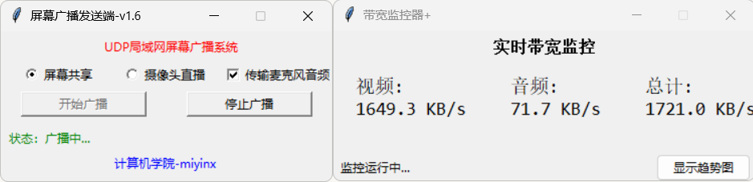
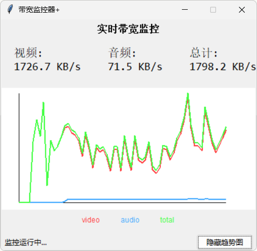

# udp局域网实时广播系统

本系统实现基于Python和UDP协议的点对多点实时音视频传输，支持屏幕共享、摄像头直播与音频广播的灵活组合传输。
基于实现的低延迟局域网屏幕/摄像头广播系统，支持音频同步传输与实时流量监控。

|模块|技术方案|
| ------| -----------------------------------------------|
|**开发语言**|Python 3.9（兼顾开发效率与跨平台特性）|
|**网络协议**|UDP协议（面向无连接传输，采用端口复用技术）|
|**视频处理**|OpenCV/PyAV（摄像头采集）+ Pillow（屏幕捕获）|
|**音频处理**|PyAudio（WASAPI音频接口，低延迟采集）|
|**数据压缩**|ZLIB压缩算法（DEFLATE压缩，压缩比可达70%）|
|**线程管理**|多线程架构（视频/音频独立线程，GIL锁优化）|
|**GUI框架**|Tkinter（轻量级界面，支持跨平台渲染）|

## 📌 功能特性

### 发送端功能

​​

* **视频多源输入切换**

  * 支持屏幕捕获（PIL.ImageGrab）
  * 支持摄像头实时采集（OpenCV，兼容主流视频采集设备）
  * 通过单选按钮实现输入源热切换（无需重启程序切换输入源）
  * 智能压缩传输（zlib压缩算法）

     [zlib --- 与 gzip 兼容的压缩 — Python 3.13.3 文档](https://docs.python.org/zh-cn/3/library/zlib.html)
* **音频传输**

  * 麦克风音频采集（PyAudio，44.1kHz采样率，16位量化）
  * 动态音频线程管理（支持广播过程中随时启停音频传输）
  * 设计资源回收机制（防止音频设备持续被占用）
* **网络传输**

  * UDP广播传输（255.255.255.255全网段覆盖）
  * 视频/音频分端口传输（视频22222端口，音频22223端口）
  * 数据分片传输（使用60KB数据包对图像数据分片发送）
  * 传输控制协议（start/over/close指令）
* **控制管理**

  * 传输状态实时监控（可视化广播状态指示）
  * 广播启停控制（带状态指示）
  * 音频传输动态开关
  * 流量控制机制（屏幕传输25FPS，摄像头10FPS）
  * 安全退出机制（可发送关闭指令强制关闭接收端）

‍

### 接收端功能

​​

* **多流处理**

  * 视频/音频并行接收（独立线程处理）
  * 双端口监听机制
  * 实时解码渲染（PIL图像处理加速）
* **显示优化**

  * 自适应窗口填充（PIL.Image.resize）
  * 智能画面填充（保持原始比例自动居中）
  * 动态分辨率适配（自动匹配发送端分辨率）
* **交互功能**

  * 支持窗口置顶管理（右键菜单快速切换）
  * 拖拽定位支持（任意位置拖动窗口）
  * 安全退出流程（资源回收机制）
* **容错机制**

  * 数据包校验（zlib.decompressobj 相当于CRC32校验，`from zlib import decompress`​）
  * 异常数据丢弃（防止数据污染）
  * 断流自动恢复（接收超时重连）

### 监控工具
​

​

- 实时带宽统计（视频/音频/总计）
- 可视化流量曲线
- 可调整刷新频率

## ♨ 相关结构
### 采用sc结构
```mermaid
graph TD
    A[发送端] -->|UDP广播| B[接收端]
    subgraph 发送端
        A1[视频采集模块] --> A2[数据压缩]
        A3[音频采集模块] --> A4[数据压缩]
        A2 --> A5[网络传输模块]
        A4 --> A5
    end
    subgraph 接收端
        B1[网络接收模块] --> B2[视频解压显示]
        B1 --> B3[音频解压播放]
    end
```
### 核心流程

```mermaid
sequenceDiagram
    participant GUI
    participant VideoThread
    participant AudioThread
    participant Network
  
    GUI->>VideoThread: 启动视频线程
    activate VideoThread
    VideoThread->>Network: 发送start标记
    loop 帧循环
        VideoThread->>VideoThread: 捕获屏幕/摄像头
        VideoThread->>VideoThread: 压缩图像数据
        VideoThread->>Network: 分块发送数据
    end
    VideoThread->>Network: 发送_over标记
    deactivate VideoThread
  
    GUI->>AudioThread: 启动音频线程
    activate AudioThread
    loop 音频采集
        AudioThread->>AudioThread: 读取音频流
        AudioThread->>AudioThread: 压缩音频数据
        AudioThread->>Network: 发送至22223端口
    end
    deactivate AudioThread
```

## 🛠️ 运行环境

```bash
Python 3.6+ | pip install -r requirements.txt

requirements.txt：

Pillow == 9.5.0
opencv-python == 4.5.5.64
pyaudio == 0.2.13
zlib == 1.2.11
```


